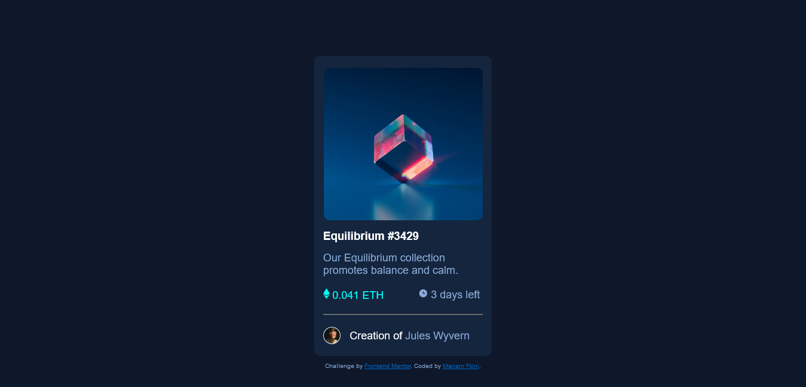

# Frontend Mentor - NFT preview card component solution

This is a solution to the [NFT preview card component challenge on Frontend Mentor](https://www.frontendmentor.io/challenges/nft-preview-card-component-SbdUL_w0U). Frontend Mentor challenges help you improve your coding skills by building realistic projects.

## Table of contents

- [Overview](#overview)
  - [The challenge](#the-challenge)
  - [Screenshot](#screenshot)
  - [Links](#links)
- [My process](#my-process)
  - [Built with](#built-with)
  - [What I learned](#what-i-learned)
  - [Continued development](#continued-development)
- [Author](#author)
- [Acknowledgments](#acknowledgments)

## Overview

This is a simple and yet, a little bit challenging challenge for whomever is starting with HTML and CSS. I suggest that you give it a try!

### The challenge

Users should be able to:

- View the optimal layout depending on their device's screen size
- See hover states for interactive elements

### Screenshot



### Links

- Solution URL: [Add solution URL here](https://your-solution-url.com)
- Live Site URL: [Add live site URL here](https://your-live-site-url.com)

## My process

### Built with

- Semantic HTML5 markup
- CSS custom properties
- Flexbox
- Mobile-first workflow

### What I learned

I learned how to use the "max-width" property to keep your design the same width when the screen size changes. I also learned more about responsiveness and media queries which was something I'm not comfortable with yet. Finally, I learned a new way to add an overlay to a section of the website without using the "::after" pseudo element and using the position "fixed" instead of absolute that is not suitable for responsive design if the element you're adding the overlay to is not the first section or the whole page.

```css I'm proud of
.img-div {
  width: 69%;
  border-radius: 10px;
  max-width: 266px;
  height: 16em;
  display: flex;
  justify-content: center;
  align-items: center;
  position: fixed;
  opacity: 0;
  transition: opacity 0.5s ease-in;
  background-color: rgba(0, 255, 247, 0.486);
}
```

### Continued development

If I found more smart and flexible ways to develop the layout, then I'll.

## Author

- Github - [Mariam-Rf](https://github.com/Mariam-Rf)
- Frontend Mentor - [Mariam-Rf](https://www.frontendmentor.io/profile/Mariam-Rf)
